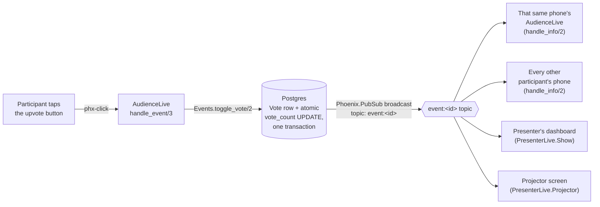

# Askroom

Live Q&A and polling for talks and meetings: the audience joins on
their phones with a short code — no account, no app download — asks
questions, upvotes the ones they care about, and answers polls, with
every screen in the room (including the presenter's, and a projector)
updating in real time. Built end-to-end in Elixir/Phoenix/OTP as a
portfolio project.

**[Live demo](#) · [Screenshot / demo GIF: a phone and a laptop updating side by side](#)**
*(placeholders — fill in once deployed; see [fly.toml](fly.toml))*

Log in with the seeded demo presenter (`demo@askroom.dev` /
`demo-password-please-change`, created automatically by `mix setup`) to
see a sample event with real questions and a live poll already in it —
its join code is on the presenter's dashboard.

## What it does

- A presenter creates an event and gets a short, unambiguous 6-character
  join code (no `0`/`O` or `1`/`I` — the pairs people misread when a
  code is projected across a room) and a QR code that points straight
  at it.
- The audience joins at `/join` or by scanning the code — no signup.
  Refreshing the page, or coming back later, keeps the same identity
  and the same votes, because it's carried in the browser session, not
  typed credentials.
- Questions are upvoted by tapping a button that toggles on/off, sorted
  live by vote count then newest. An optional moderation mode holds new
  questions for the presenter's approval before the audience sees them.
- The presenter launches a poll and watches results update live as a
  bar chart; closing it freezes the results. The audience answers with
  one tap, one answer per participant, enforced by the database.
- A "projector" view — clean, full-screen, large text — automatically
  shows whichever is more relevant: a live poll's results while one's
  running, the top questions otherwise. No manual toggle.
- A live "N people here now" count via `Phoenix.Presence`.
- Closing an event freezes it and produces a summary: top questions,
  final poll results. A nightly job closes anything left open more than
  24 hours, so a forgotten event doesn't sit open indefinitely.

## Why Elixir for this, specifically

This is a many-small-processes, many-live-updates problem — dozens to
hundreds of independent phones and a couple of dashboards, all needing
to see the same event's changes within milliseconds of each other, with
no single request/response cycle that ever "finishes." That's close to
the shape of problem the BEAM was built for, and this app leans on that
directly rather than incidentally:

- **One PubSub topic per event, and every screen — including the one
  that just took the action — reacts through it.** A participant's own
  vote updates their own screen the exact same way it updates everyone
  else's: through `Phoenix.PubSub`, not a special-cased local update.
  That's one code path to reason about instead of two, and it's a
  design LiveView makes genuinely easy — see
  [ADR 3](docs/decisions/0003-per-event-pubsub-topics.md) for the sharp
  edge this creates in tests and why it's worth understanding rather
  than working around.
- **`Phoenix.Presence` for the "who's here" count**, because it already
  solves the hard, easy-to-get-wrong parts of that problem — merging
  presence state cleanly if this app ever ran on more than one node,
  handling a phone disconnecting without a clean goodbye — instead of
  this app needing to reinvent any of it.
- **The database as the actual source of correctness**, not the
  language. OTP makes it cheap to have many concurrent processes; it
  doesn't make "two people tap upvote in the same millisecond" correct
  by default. This app leans on Postgres — a unique index, an atomic
  `UPDATE ... SET vote_count = vote_count + 1` — for the guarantees that
  actually matter under concurrency, rather than trying to serialize
  everything through a single process. See
  [ADR 2](docs/decisions/0002-database-enforced-voting.md).
- **Let it crash, scoped tightly.** Every connected participant is their
  own LiveView process. One phone's flaky connection, or a bug in
  rendering one edge case, doesn't touch anyone else's session — there's
  no shared mutable state between them to corrupt in the first place.

## How a vote travels: phone → database → every screen



The vote count itself is never computed by re-reading and incrementing
in Elixir — `Repo.update_all/2` issues one atomic SQL statement, so two
simultaneous taps can never both read "5" and both write "6." See
[ADR 2](docs/decisions/0002-database-enforced-voting.md).

## Tech stack

Phoenix 1.7 + LiveView · Ecto/Postgres · Oban (nightly stale-event
cleanup) · Phoenix.Presence · eqrcode (server-rendered join QR codes) ·
Credo (`--strict`) + Dialyzer in CI · GitHub Actions · Docker
(`mix release`) · Fly.io.

## Running it locally (under 5 minutes)

Prerequisites: Elixir 1.20+ / OTP 29 (see [`Dockerfile`](Dockerfile) for
the exact versions this was built against) and a local Postgres.

```bash
git clone <this-repo-url>
cd askroom
mix setup        # deps, DB create + migrate, seeds (demo presenter + sample event), assets
mix phx.server
```

Visit `http://localhost:4000`, log in as `demo@askroom.dev` /
`demo-password-please-change`, and open the sample event's join link
(shown on the dashboard) in a second tab or your phone to see both
sides live at once.

To verify the whole thing end to end:

```bash
mix test                # 235 tests, no real network calls anywhere
mix credo --strict
mix dialyzer
```

## Deploying

`Dockerfile` (multi-stage, `mix release`-based) and `fly.toml` are
included. `fly.toml` is a template — `fly launch` and `fly secrets set
DATABASE_URL SECRET_KEY_BASE` are still required before `fly deploy`
will work. Worth reading the comments in `fly.toml`: this app needs no
extra work to run correctly across multiple machines — `dns_cluster`
connects the nodes, and `Phoenix.PubSub`/`Phoenix.Presence` are already
cluster-aware once they are, so `fly scale count 2` really is the whole
multi-node story here.

## Design decisions

Three of the less-obvious calls made building this are written up in
[`docs/decisions/`](docs/decisions/), each with the alternative
considered and why it lost:

1. [Anonymous, session-based participants — no accounts for the audience](docs/decisions/0001-anonymous-session-based-participants.md)
2. [Database-enforced voting rules, with atomic counters](docs/decisions/0002-database-enforced-voting.md)
3. [One PubSub topic per event, and every screen reacts through it](docs/decisions/0003-per-event-pubsub-topics.md)

`CLAUDE.md` in the repo root has the conventions every phase of this
build held to (contexts own all business logic, the web layer never
touches `Repo` directly, every public context function has `@doc` +
`@spec`, tests ship alongside every feature).

## What I'd do next

- **Batching broadcasts under vote bursts.** Right now every single vote
  triggers its own broadcast and a full requery on every subscriber.
  Fine for one talk's audience; a much larger crowd hammering the
  upvote button in the same few seconds would be better served by
  coalescing rapid changes into one broadcast per short window instead
  of one per tap.
- **Running across multiple servers for real** — the pieces are already
  cluster-aware (see the deploying section above), but this has only
  ever actually run as one node. Worth actually standing up two Fly
  machines and confirming a vote cast against one reaches a participant
  connected to the other.
- **AI grouping of similar questions.** A popular talk can end up with
  five near-duplicate phrasings of the same question; clustering them
  (even just an LLM pass suggesting merges) would make the presenter's
  moderation queue and the projector's top-questions list more useful.
- **CSV export** of an event's questions and poll results, for a
  presenter who wants the raw data afterward rather than just the
  in-app summary.
- **A word-cloud poll type**, alongside the existing multiple-choice
  polls — free-text answers aggregated into a live word cloud, for the
  "what's one word to describe X" style of question multiple-choice
  can't capture.
