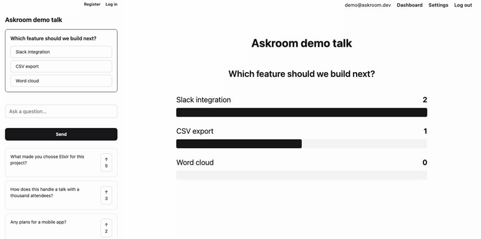
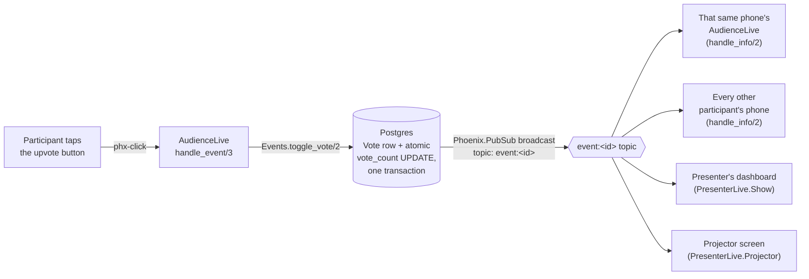

# Askroom

Live Q&A and polling for talks and meetings. The audience joins on
their phones with a short code — no account, no app download — and
every screen in the room, including the presenter's and a projector,
updates in real time.

[](https://github.com/Nabeel-Siddiqui/askroom/actions)

**Runs locally in under 5 minutes** with seeded demo data. See
[Running it locally](#running-it-locally).



## What it does

- A presenter creates an event and gets a short, unambiguous
  6-character join code. The alphabet skips `0`/`O` and `1`/`I`, the
  pairs people misread when a code is projected across a room. A QR
  code points straight at it.
- The audience joins at `/join` or by scanning the code, with no
  signup. Identity and votes are carried in the browser session, so
  refreshing the page or coming back later keeps both.
- Questions are upvoted by tapping a button that toggles on and off,
  sorted live by vote count then newest. An optional moderation mode
  holds new questions for the presenter's approval before the audience
  sees them.
- The presenter launches a poll and watches results update live as a
  bar chart; closing it freezes the results. The audience answers with
  one tap, one answer per participant, enforced by the database.
- A "projector" view (clean, full-screen, large text) shows whichever
  is more relevant on its own: a live poll's results while one's
  running, the top questions otherwise. No manual toggle.
- A live "N people here now" count via `Phoenix.Presence`. Closing an
  event freezes it with a summary (top questions, final poll results),
  and a nightly job closes anything left open more than 24 hours so a
  forgotten event doesn't sit open indefinitely.

## Why Elixir for this, specifically

This is a many-small-processes, many-live-updates problem: dozens to
hundreds of independent phones and a couple of dashboards, all needing
to see the same event's changes within milliseconds of each other. This
app leans on that directly rather than incidentally.

- **No accounts for the audience, just a signed session.** A
  `Participant` is a real database row, but it's never tied to a login —
  its id lives in the visitor's session cookie, minted on first visit
  and reused on every later one. Entering a code is the entire signup
  flow, which matters for a tool people are meant to use within seconds
  of opening their phone at a talk.
  [ADR 1](docs/decisions/0001-anonymous-session-based-participants.md)
- **The database is the actual source of correctness, not the
  language.** OTP makes many concurrent processes cheap; it doesn't by
  itself make "two people tap upvote in the same millisecond" come out
  right. This app leans on Postgres for the guarantees that matter under
  concurrency: a unique index, an atomic `UPDATE ... SET vote_count =
  vote_count + 1`.
  [ADR 2](docs/decisions/0002-database-enforced-voting.md)
- **One PubSub topic per event, and every screen reacts through it,
  including the one that just took the action.** A participant's own
  vote updates their own screen the same way it updates everyone
  else's. There's no separate, special-cased path for "my own update" —
  one code path to reason about instead of two.
  [ADR 3](docs/decisions/0003-per-event-pubsub-topics.md)

## Architecture

A vote travels the same path every screen in the room is listening on:



Every connected participant is their own LiveView process. One phone's
flaky connection, or a bug in rendering one edge case, can't touch
anyone else's session — there's no shared mutable state between them to
corrupt in the first place.

## Tech stack

Phoenix 1.7 + LiveView · Ecto/Postgres · Oban (nightly stale-event
cleanup) · Phoenix.Presence · eqrcode (server-rendered join QR codes) ·
Credo (`--strict`) + Dialyzer in CI · GitHub Actions · Docker
(`mix release`).

## Running it locally

Prerequisites: Elixir 1.20.3 / OTP 29.0.5 (see [`Dockerfile`](Dockerfile)
— any recent Elixir/OTP pair should work fine too) and a local Postgres.

```bash
git clone <this-repo-url>
cd askroom
mix setup        # deps, DB create + migrate, seeds (demo presenter + sample event), assets
mix phx.server
```

Visit `http://localhost:4000`, log in as `demo@askroom.dev` /
`demo-password-please-change`, and open the sample event's join link
(shown on the dashboard) in a second tab or your phone to see both
sides live at once.

To verify the whole thing end to end:

```bash
mix test                # 235 tests, no real network calls anywhere
mix credo --strict
mix dialyzer
```

## Design decisions

Three of the less-obvious calls made building this are written up in
[`docs/decisions/`](docs/decisions/), each with the alternative
considered and why it lost:

1. [Anonymous, session-based participants — no accounts for the audience](docs/decisions/0001-anonymous-session-based-participants.md)
2. [Database-enforced voting rules, with atomic counters](docs/decisions/0002-database-enforced-voting.md)
3. [One PubSub topic per event, and every screen reacts through it](docs/decisions/0003-per-event-pubsub-topics.md)

`CLAUDE.md` in the repo root has the conventions every phase of this
build held to (contexts own all business logic, the web layer never
touches `Repo` directly, every public context function has `@doc` +
`@spec`, tests ship alongside every feature).

## What I'd do next

- **Batching broadcasts under vote bursts.** Right now every single vote
  triggers its own broadcast and a full requery on every subscriber.
  Fine for one talk's audience; a much larger crowd hammering the
  upvote button in the same few seconds would be better served by
  coalescing rapid changes into one broadcast per short window instead
  of one per tap.
- **Running across multiple servers for real.** The pieces are already
  cluster-aware (`dns_cluster`, and `Phoenix.PubSub`/`Phoenix.Presence`
  are cluster-aware once connected), but this has only ever actually run
  as one node. Worth standing up two machines and confirming a vote cast
  against one reaches a participant connected to the other.
- **AI grouping of similar questions.** A popular talk can end up with
  five near-duplicate phrasings of the same question. Clustering them
  (even just an LLM pass suggesting merges) would make the presenter's
  moderation queue and the projector's top-questions list more useful.
- **CSV export** of an event's questions and poll results, for a
  presenter who wants the raw data afterward rather than just the
  in-app summary.
- **A word-cloud poll type**, alongside the existing multiple-choice
  polls. Free-text answers aggregated into a live word cloud would
  cover the "what's one word to describe X" style of question that
  multiple-choice can't.
